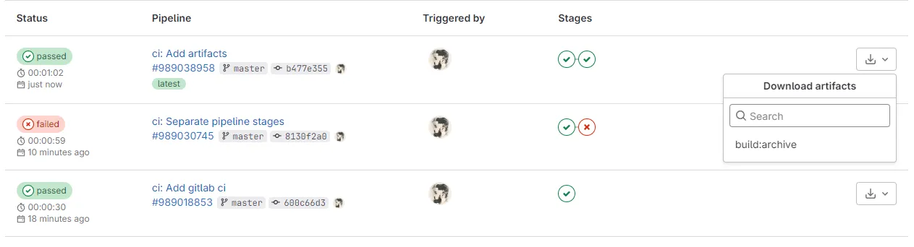

In this post we create a vanilla javascript project using vite and set up its deployment pipeline using gitlab ci.

Here is the link to the gitlab project if you want to see the pipelines or the final code.

https://gitlab.com/amiralitaheri/gitlab-artifacts


## Setting up the environment
We start by creating the project. And then we create `.gitlab-ci.yml`

```bash
npm create vite
```

## Everything in one place

```yaml
image: node:latest

stages:
  - everything

everything-production:
    stage: everything
    script:
        - npm install
        - npm run build
        - ls dist # Deploy dist folder to our production server using docker or something else
    only:
        - master
```

This a very minimal pipeline that works as expected, but we are violating **Single responsibility** principle by doing everything in one stage.
Imagine that we want to have a release candidate or beta release where we deploy or develop branch on our beta server. Then we need to copy everything :)

```yaml
image: node:latest

stages:
  - everything

everything-production:
    stage: everything
    script:
        - npm install
        - npm run build
        - ls dist # Deploy dist folder to our production server using docker or something else
    only:
        - master

everything-beta:
    stage: everything
    script:
        - npm install
        - npm run build
        - ls dist # Deploy dist folder to our beta server using docker or something else
    only:
        - develop
```

## Using stages to avoid duplication

```yaml
image: node:latest

stages:
  - build
  - deploy

build:
    stage: build
    script:
        - npm install
        - npm run build
    only:
        - master
        - develop

deploy-production:
    stage: deploy
    script:
        - ls dist # Deploy dist folder to our production server using docker or something else
    only:
        - master

deploy-beta:
    stage: deploy
    script:
        - ls dist # Deploy dist folder to our beta server using docker or something else
    only:
        - develop
```

We used stages to seperated our stages but when we try to run this pipeline we would get the error below:
```
ls: cannot access 'dist': No such file or directory
```
It's because each stage runs on a completely new environment and our dist folder from build stage can't be found here.

## Artifacts to the rescue

By adding `artifacts` to our build pipeline, it stores the files of `dist` folder for us.
And by adding `dependencies` to our deploy scripts, we request access to artifacts of build.

```yaml
image: node:latest

stages:
  - build
  - deploy

build:
    stage: build
    script:
        - npm install
        - npm run build
    artifacts:
      paths:
        - dist
    only:
        - master
        - develop

deploy-production:
    stage: deploy
    dependencies:
      - build
    script:
        - ls dist # Deploy dist folder to our production server using docker or something else
    only:
        - master

deploy-beta:
    stage: deploy
    dependencies:
      - build
    script:
        - ls dist # Deploy dist folder to our beta server using docker or something else
    only:
        - develop
```

## Bonus point

You can download the artifacts generated by your pipeline via Gitlab website.



To know more about gitlab artifacts see the [official document](https://docs.gitlab.com/ee/ci/jobs/job_artifacts.html).